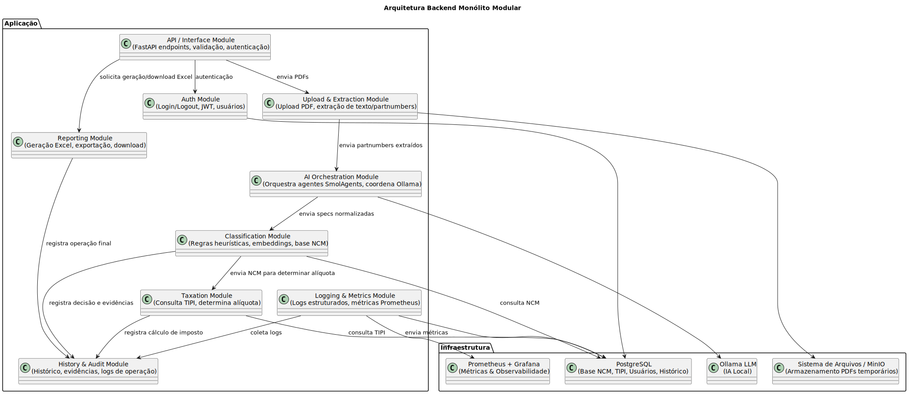
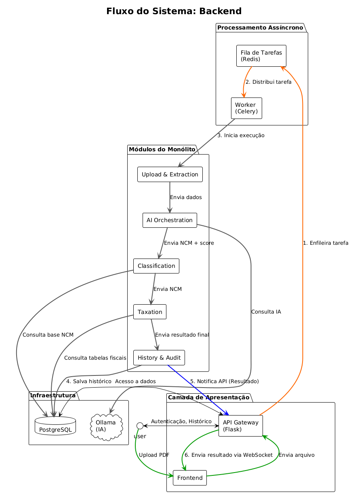

# 📘 Documento de Arquitetura – Backend

## 1. Visão Geral


O backend tem como objetivo **automatizar a classificação de NCM e cálculo de alíquotas**, a partir de PDFs de pedidos de compra que contêm partnumbers de produtos tecnológicos. O sistema utiliza **FastAPI** como framework principal, aproveitando sua performance, validação nativa, e preparação para tarefas assíncronas (busca specs, IA, geração Excel).

Fluxo principal:

1. Usuário faz login (autenticação).
2. Faz upload do PDF.
3. Backend extrai partnumbers.
4. SmolAgents + Ollama (IA local) buscam especificações técnicas e classificam o produto no NCM.
5. Sistema calcula alíquotas correspondentes consultando tabela oficial.
6. Resultado é salvo no banco e exportado em Excel.
7. Usuário pode consultar histórico de suas operações.

O sistema será implementado em **arquitetura monolítica modular** para manter simplicidade e velocidade de desenvolvimento.

---

## 2. Camadas da Aplicação

* **Camada de Apresentação (Interface de API)**
  * Framework: **FastAPI**
  * Endpoints RESTful (JSON/Excel como resposta)
  * Stateless (autenticação via JWT e refresh token)
  * Documentação automática via Swagger/OpenAPI (nativo do FastAPI)

* **Camada de Aplicação (Orquestração de Casos de Uso)**

  * Regras de orquestração (ex.: coordenar extração → IA → NCM → Excel).
  * Invoca agentes (SmolAgents) para delegar subtarefas de IA.
  * Controla execução síncrona/assíncrona (dependendo do volume).

* **Camada de Domínio (Regras de Negócio)**

  * Entidades: Usuário, Operação, Produto, ClassificaçãoNCM.
  * Lógica de classificação híbrida (heurísticas + embeddings via Ollama).
  * Políticas de validação (confidence score, auditoria).

* **Camada de Infraestrutura**

  * Banco de Dados: **PostgreSQL** (via SQLAlchemy ORM).
  * Armazenamento de Arquivos: disco local ou S3-like (min.io para dev).
  * AI Runtime: **Ollama** (modelos LLM rodando localmente).
  * SmolAgents para orquestração modular de subtarefas.
  * Scheduler assíncrono (Celery + Redis, opcional, para tarefas pesadas).

---

## 3. Módulos da Aplicação
Cada módulo é implementado como um **componente interno do monólito**, projetado segundo o princípio de **Responsabilidade Única**.
O objetivo é reduzir o acoplamento e facilitar o desenvolvimento paralelo.
O desenvolvimento deve se guiar estritamente pelas definições abaixo. O projeto segue Monólito Modular com forte inspiração em:
- **Single Responsibility Principle (SRP)**: Cada módulo do monólito foi definido com uma única responsabilidade clara, evitando sobreposição de funções. Isso garante baixo acoplamento (módulos independentes entre si) e alta coesão (cada módulo focado em uma única tarefa).
- **Layered Architecture / Clean Architecture**: .
- **Orchestration Pattern para a IA**: 
---

## Esqueleto sugerido

### Justificativa da Estrutura

A estrutura de diretórios e arquivos foi projetada para refletir a **arquitetura monolítica modular** que você definiu. Cada módulo do seu documento de arquitetura (API, Auth, Upload & Extraction, etc.) tem sua própria pasta dedicada. Essa organização promove:

1.  **Baixo Acoplamento:** A comunicação entre os módulos é gerenciada pela camada de aplicação (`app/services/processing_service.py`), garantindo que um módulo não precise conhecer os detalhes de implementação de outro.
2.  **Alta Coesão:** Cada pasta de módulo contém tudo o que é necessário para a sua responsabilidade, como *endpoints* da API (`routers.py`), lógica de negócio (`services.py`), e modelos de dados (`models.py`).
3.  **Clareza e Manutenibilidade:** A estrutura de diretórios é intuitiva. Um novo desenvolvedor pode facilmente encontrar onde cada parte da lógica está implementada.
4.  **Preparação para o Futuro:** Se, no futuro, você decidir desacoplar um módulo (como o **AI Orchestration**) em um microsserviço, a transição será muito mais suave, pois ele já opera de forma independente.

A camada de infraestrutura (`app/infra/`) está separada para gerenciar as conexões com recursos externos (banco de dados, S3, Ollama), mantendo a lógica de negócio principal livre de dependências de infraestrutura.

-----

### Esqueleto do Código

```
.
├── .env.example
├── Dockerfile
├── docker-compose.yml
├── requirements.txt
└── app/
    ├── __init__.py
    ├── main.py
    ├── config.py              # Configurações globais (settings)
    │
    ├── database/
    │   ├── __init__.py
    │   ├── database.py        # Conexão com o DB (SQLAlchemy)
    │   └── models.py          # Mapeamento de modelos do DB
    │
    ├── infra/
    │   ├── __init__.py
    │   ├── ollama_client.py   # Client para interação com Ollama
    │   ├── s3_client.py       # Client para S3/MinIO
    │   └── pdf_parser.py      # Lógica de baixo nível para parsear PDFs
    │
    ├── auth/
    │   ├── __init__.py
    │   ├── routers.py         # Endpoints de autenticação (/login, /register)
    │   ├── services.py        # Lógica de login/logout, hashing de senhas
    │   ├── schemas.py         # Pydantic models para validação de dados
    │   └── security.py        # Funções para JWT
    │
    ├── upload_extraction/
    │   ├── __init__.py
    │   ├── routers.py         # Endpoint de upload do PDF
    │   ├── services.py        # Lógica de extração, salvamento temporário
    │   └── schemas.py
    │
    ├── ai_orchestration/
    │   ├── __init__.py
    │   ├── agents/
    │   │   ├── __init__.py
    │   │   ├── spec_finder_agent.py  # Agente para buscar especificações
    │   │   └── ncm_classifier_agent.py # Agente para classificar NCM
    │   └── services.py               # Orquestração dos agentes
    │
    ├── classification/
    │   ├── __init__.py
    │   ├── services.py        # Lógica de classificação NCM
    │   └── schemas.py
    │
    ├── taxation/
    │   ├── __init__.py
    │   ├── services.py        # Lógica para calcular alíquotas
    │   └── schemas.py
    │
    ├── reporting/
    │   ├── __init__.py
    │   ├── routers.py         # Endpoint para exportar Excel
    │   ├── services.py        # Lógica de geração de relatórios (pandas)
    │   └── schemas.py
    │
    ├── history_audit/
    │   ├── __init__.py
    │   ├── routers.py         # Endpoints para consultar histórico
    │   ├── services.py        # Lógica de consulta e registro de histórico
    │   └── schemas.py
    │
    ├── logging_metrics/
    │   ├── __init__.py
    │   ├── logger.py          # Configuração do logger (structlog)
    │   └── metrics.py         # Funções para métricas (Prometheus)
    │
    ├── api/
    │   ├── __init__.py
    │   └── routers.py         # Roteador principal que inclui os outros
    │
    ├── services/
    │   ├── __init__.py
    │   └── processing_service.py # Orquestração do fluxo principal (PDF -> NCM)
    │
    └── utils/
        ├── __init__.py
        └── decorators.py      # Decoradores úteis (ex: para logging)
```

-----

### Detalhes Importantes do Esqueleto
  * **`main.py`:** O arquivo principal que inicializa o aplicativo FastAPI, conecta ao banco de dados e inclui todos os roteadores de API dos módulos.
  * **`core/config.py`:** Centraliza todas as configurações (tokens JWT, credenciais de banco, etc.) em um único local. O uso do Pydantic `BaseSettings` para gerenciar as configurações é uma ótima prática.
  * **`database/`:** Contém o arquivo `database.py` para a inicialização do SQLAlchemy e `models.py` para a definição das tabelas, mantendo a camada de persistência bem organizada.
  * **Módulos (`auth/`, `upload_extraction/`, etc.):** Cada módulo tem uma estrutura interna consistente:
      * `routers.py`: Define os endpoints da API.
      * `services.py`: Contém a lógica de negócio principal do módulo.
      * `schemas.py`: Define os modelos de dados para validação com Pydantic.
  * **`api/routers.py`:** Este arquivo age como o "roteador mestre", importando e incluindo os roteadores de cada módulo (`/auth/routers.py`, `/upload_extraction/routers.py`, etc.). Isso mantém o `main.py` limpo e centraliza a definição de rotas.
  * **`services/processing_service.py`:** Este é o coração do seu "Fluxo Principal". Ele orquestra a chamada de serviços de diferentes módulos na ordem correta:
      * Chama `upload_extraction.services.extract_partnumbers()`.
      * Passa o resultado para `ai_orchestration.services.run_agents()`.
      * O resultado da IA é enviado para `classification.services.classify_ncm()`.
      * E assim por diante.
---

### 1. **Auth Module**

**Responsabilidade Única**:
Gerenciar autenticação e autorização de usuários.

**Responsabilidades Detalhadas (Funcionalidades)**:

* Registro e login/logout de usuários.
* Geração e validação de tokens JWT.
* Armazenamento seguro de credenciais (hash de senhas).
* Endpoints: `/login`, `/register`, `/logout`.

**Tecnologias Sugeridas**:
* **Banco**: PostgreSQL.
* **Autenticação**: JWT (`fastapi-jwt-auth` ou `fastapi-users`).
* **Segurança**: `bcrypt` para hashing.

**Atributos adicionais**:

* **Escalabilidade**: Stateless (tokens não armazenados em sessão).
* **Auditabilidade**: Registra tentativas de login mal-sucedidas.

---

### 2. **Upload & Extraction Module**

**Responsabilidade Única**:
Gerenciar o upload de PDFs e extrair dados relevantes (texto, partnumbers).

**Responsabilidades Detalhadas**:

* Upload de arquivos (validação de tamanho e formato).
* Extração de texto com bibliotecas de parsing.
* Normalização inicial (remoção de caracteres especiais, quebra de linhas).
* Armazenamento temporário em disco ou bucket.

**Tecnologias Sugeridas**:
* **Upload**: FastAPI (streaming nativo).
* **Parsing PDF**: PyMuPDF ou pdfminer.six.
* **Armazenamento temporário**: sistema de arquivos local ou MinIO (compatível com S3).

**Atributos adicionais**:

* **Resiliência**: deve suportar PDFs corrompidos sem travar pipeline.

---

### 3. **AI Orchestration Module**

**Responsabilidade Única**:
Orquestrar agentes de IA especializados para diferentes tarefas.

**Responsabilidades Detalhadas**:

* Gerenciar ciclo de execução de agentes SmolAgents.
* Definir ordem de chamadas: buscar especificações, normalizar, classificar.
* Repassar resultados entre agentes.
* Consolidar saídas em formato padronizado para o **Classification Module**.

**Tecnologias Sugeridas**:
* **Agentes**: SmolAgents.
* **LLM**: Ollama rodando localmente.
* **Protocolo interno**: JSON padronizado entre agentes.

**Atributos adicionais**:

* **Extensibilidade**: novos agentes podem ser plugados sem alterar o restante do sistema.

---

### 4. **Classification Module**

**Responsabilidade Única**:
Aplicar regras de negócio para classificar produtos em códigos NCM.

**Responsabilidades Detalhadas**:

* Regras heurísticas (regex, keywords).
* Classificação semântica via embeddings.
* Consulta em base de NCM armazenada em Postgres.
* Combinação das evidências (IA + heurísticas + base).
* Retorno do NCM mais provável + score de confiança.

**Tecnologias Sugeridas**:
* **NLP**: Ollama (embeddings).
* **Heurísticas**: Regex (módulo `re`).
* **Banco**: PostgreSQL com tabela NCM.
* **Busca Vetorial**: FAISS ou pgvector (plugin Postgres).

**Atributos adicionais**:

* **Confiabilidade**: deve registrar todas as evidências que justificaram a classificação.

---

### 5. **Taxation Module**

**Responsabilidade Única**:
Determinar alíquotas e tributos aplicáveis a partir do NCM classificado.

**Responsabilidades Detalhadas**:

* Consultar tabela TIPI (Postgres).
* Associar NCM → Alíquota correta.
* Tratar exceções (regimes especiais, isenções).

**Tecnologias Sugeridas**:
* **Banco**: PostgreSQL.
* **Regras adicionais**: camada de negócio implementada em Python.

**Atributos adicionais**:

* **Atualizável**: a tabela TIPI deve permitir updates periódicos com facilidade.

---

### 6. **Reporting Module**

**Responsabilidade Única**:
Gerar relatórios consolidados de classificação.

**Responsabilidades Detalhadas**:

* Geração de arquivos Excel com pandas + openpyxl.
* Exportação para download via API.
* Registro automático das operações realizadas.

**Tecnologias Sugeridas**:
* **Relatórios**: pandas, openpyxl.
* **Exportação**: FastAPI endpoints (download de arquivos via StreamingResponse).

**Atributos adicionais**:

* **Padronização**: relatórios devem seguir template fixo.

---

### 7. **History & Audit Module**

**Responsabilidade Única**:
Registrar e disponibilizar histórico/auditoria das classificações.

**Responsabilidades Detalhadas**:

* Armazenar operações vinculadas ao usuário.
* Guardar metadados (partnumber, NCM, score, evidências).
* Fornecer consultas históricas.

**Tecnologias Sugeridas**:
* **Banco**: PostgreSQL.
* **Consulta**: SQL + APIs REST.

**Atributos adicionais**:

* **Auditabilidade**: registros imutáveis (sem deleção).

---

### 8. **Logging & Metrics Module**

**Responsabilidade Única**:
Gerar logs estruturados e métricas de monitoramento.

**Responsabilidades Detalhadas**:

* Logging JSON com `structlog`.
* Exposição de métricas no padrão Prometheus.
* Integração com Grafana para dashboards.
* KPIs principais:

  * Tempo de processamento por operação.
  * Volume de classificações por usuário.
  * Score médio de confiança.
  * Taxa de erros/falhas.

**Tecnologias Sugeridas**:
* **Logging**: Python `logging` + `structlog`.
* **Métricas**: Prometheus + Grafana.

**Atributos adicionais**:

* **Observabilidade**: cada operação deve ser rastreável ponta a ponta.

---

## 4. Comunicação entre Módulos

* **Interna (dentro do monólito):**

  * Via chamadas diretas de função (baixa latência).
  * Camada de aplicação chama módulos de domínio e infraestrutura.

* **Externa:**

  * Cliente → API REST (FastAPI).
  * FastAPI → SmolAgents (Python calls).
  * SmolAgents → Ollama (via HTTP local API).
  * FastAPI → Postgres (via SQLAlchemy ORM).

---

## 5. Dependências entre Módulos

* **Auth Module** → Postgres.
* **Upload & Extraction** → Infraestrutura de arquivos.
* **AI Orchestration** → SmolAgents, Ollama.
* **Classification** → AI Orchestration + Base NCM em Postgres.
* **Taxation** → Classification + Tabelas TIPI (Postgres).
* **Reporting** → Classification + Taxation + Infraestrutura Excel.
* **History & Audit** → Todos os outros (precisa de logs/DB).
* **Logging & Metrics** → Transversal a todos os módulos.

---

## 6. Mapeamento de Tecnologia por Módulo

| Módulo              | Tecnologia / Biblioteca                 |
| ------------------- | --------------------------------------- |
| Auth                | fastapi-jwt-auth, fastapi-users, SQLAlchemy |
| Upload & Extraction | FastAPI, PyMuPDF, pdfminer.six            |
| AI Orchestration    | SmolAgents, Ollama (HTTP API local)     |
| Classification      | Regex, heurísticas, Ollama embeddings   |
| Taxation            | Postgres (tabelas TIPI/NCM), SQLAlchemy |
| Reporting           | pandas, openpyxl                        |
| History & Audit     | SQLAlchemy, Postgres                    |
| Logging & Metrics   | structlog, Prometheus, Grafana, Loki    |

---


## 7. Tecnologias e Infraestrutura

* **Linguagem:** Python
* **Framework API:** FastAPI
* **Documentação automática:** Swagger/OpenAPI (nativo do FastAPI, acessível em `/docs`)
* **Banco de Dados:** PostgreSQL
* **ORM:** SQLAlchemy
* **Agentes:** SmolAgents
* **IA Local:** Ollama (modelos LLM/embeddings sem dependência de API externa)
* **Mensageria (se necessário, para async):** Redis + Celery
* **Armazenamento de arquivos:** Disco local (dev) / MinIO ou S3 (prod)
* **Containerização:** Docker + docker-compose
* **Observabilidade:**
  * Logs estruturados (JSON) via structlog
  * Métricas via Prometheus + Grafana
  * Logs centralizados (Loki ou ELK, opcional)

* **Documentação da API:** Gerada automaticamente via **Swagger** (OpenAPI), utilizando o recurso nativo do FastAPI. Isso garante que todos os endpoints estejam sempre documentados e acessíveis para desenvolvedores e integradores através da interface interativa disponível em `/docs`.
---

## 8. Logger e Métricas

* **Logger:**

  * Formato JSON.
  * Níveis: INFO (operações normais), WARN (classificação incerta), ERROR (falhas).
  * Inclui correlação por `operation_id` para rastrear todo o fluxo.

* **Métricas (Prometheus):**

  * `operation_processing_time_seconds` (histogram).
  * `ncm_classification_confidence` (gauge).
  * `user_operations_total` (counter).
  * `pdf_upload_errors_total` (counter).

---

## 9. Considerações de Projeto

* **Monólito modular:** facilita desenvolvimento inicial em equipe.
* **Baixo acoplamento e alta coesão:** módulos especializados, comunicação bem definida.
* **Stateless:** API não guarda sessão em memória; autenticação via JWT.
* **Performance:**
  * Processos simples → síncronos (extração de texto).
  * Processos pesados (busca specs, embeddings) → assíncronos (Celery/Redis).
* **Segurança:**
  * Senhas hash com bcrypt.
  * JWT tokens expiram.
  * Sanitização de inputs.
* **Confiabilidade:** logs + auditoria para rastreabilidade fiscal.

---

## Entregas por sprint

### Primeira Entrega
- receber partnumber
- classificar NCM 
- encontrar alíquota -> devolver json

### Segunda Entrega
- upload pdf 
- extrair partnumber 
- classificar NCM
- encontrar aliquota 
- salvar resultado -> devolver json
- acessar histórico de operações

### Terceira Entrega
- login 
- upload pdf 
- extrair partnumber 
- classificar NCM
- encontrar aliquota 
- salvar resultado -> devolver json/ excel
- acessar histórico de operações


## Diagrama
<!--  -->
