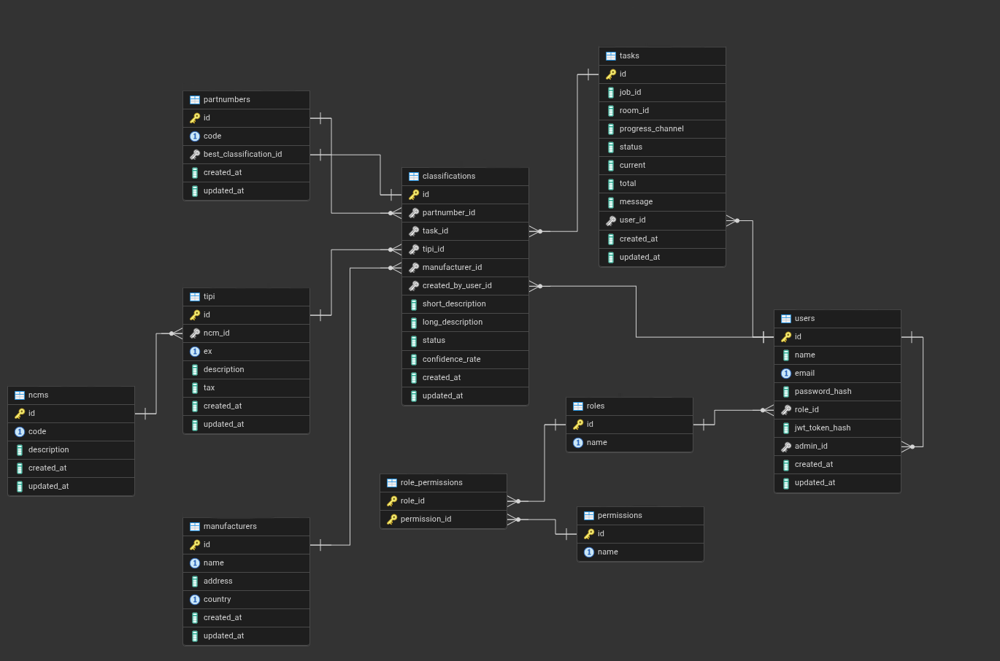

# **Documentação do Banco de Dados – Projeto NEXA**

## 1\. Visão Geral

Este documento detalha a estrutura do banco de dados para o projeto **NEXA**. O schema foi desenhado para armazenar informações sobre usuários, tarefas de processamento, e os dados essenciais para a classificação de produtos.

O banco de dados está sendo implementado em PostgreSQL.

-----

## 2\. Modelo Lógico

O diagrama abaixo ilustra a relação entre as principais entidades do sistema, incluindo o novo modelo de autorização.

-----

## 3\. Dicionário de Dados

### Tabela: `roles`

Define os papéis (grupos de permissões) que podem ser atribuídos aos usuários.

| Nome da Coluna | Tipo de Dado | Restrições | Descrição |
| :--- | :--- | :--- | :--- |
| `id` | `INTEGER` | **PK**, IDENTITY | Identificador único do papel. |
| `name` | `VARCHAR(80)` | NOT NULL, **UNIQUE** | Nome do papel (ex: 'ADMIN', 'USER', 'AUDITOR'). |

### Tabela: `permissions`

Catálogo de todas as ações granulares que podem ser controladas no sistema.

| Nome da Coluna | Tipo de Dado | Restrições | Descrição |
| :--- | :--- | :--- | :--- |
| `id` | `INTEGER` | **PK**, IDENTITY | Identificador único da permissão. |
| `name` | `VARCHAR(100)`| NOT NULL, **UNIQUE** | Nome da permissão (ex: 'create\_task', 'delete\_user'). |

### Tabela de Junção: `role_permissions`

Associa Papéis a Permissões, definindo quais ações cada papel pode executar.

| Nome da Coluna | Tipo de Dado | Restrições | Descrição |
| :--- | :--- | :--- | :--- |
| `role_id` | `INTEGER` | **PK**, **FK** (roles.id) | ID do papel. |
| `permission_id` | `INTEGER` | **PK**, **FK** (permissions.id) | ID da permissão concedida ao papel. |

### Tabela: `users`

Armazena as informações dos usuários que interagem com o sistema NEXA.

| Nome da Coluna | Tipo de Dado | Restrições | Descrição |
| :--- | :--- | :--- | :--- |
| `id` | `INTEGER` | **PK**, IDENTITY | Identificador único do usuário. |
| `name` | `VARCHAR(120)` | NOT NULL | Nome completo do usuário. |
| `email` | `VARCHAR(120)` | NOT NULL, **UNIQUE** | E-mail para login, deve ser único. |
| `password_hash` | `VARCHAR(128)` | NOT NULL | Hash da senha do usuário. |
| `role_id` | `INTEGER` | **FK** (roles.id), NOT NULL | Papel atribuído a este usuário, que define suas permissões. |
| `jwt_token_hash`| `VARCHAR(256)` | NULLABLE | Hash do token JWT para invalidação de sessão. |
| `admin_id` | `INTEGER` | **FK** (users.id) | ID do usuário administrador que supervisiona este usuário. |
| `created_at` | `TIMESTAMPTZ` | DEFAULT NOW() | Data e hora de criação do registro. |
| `updated_at` | `TIMESTAMPTZ` | DEFAULT NOW() | Data e hora da última atualização do registro. |

### Tabela: `tasks`

Registra as tarefas assíncronas de processamento de documentos.

| Nome da Coluna | Tipo de Dado | Restrições | Descrição |
| :--- | :--- | :--- | :--- |
| `id` | `VARCHAR(256)` | **PK** | Identificador único da tarefa. |
| `status` | `task_status` | NOT NULL, DEFAULT 'STARTED' | Estado atual da tarefa (`STARTED`, `PROCESSING`, etc.). |
| `user_id` | `INTEGER` | **FK** (users.id) | Usuário que iniciou a tarefa. |
| `...` | `...` | `...` | (demais colunas como na versão anterior) |

### Tabela: `partnumbers`

Armazena os códigos de produto (part numbers) únicos que são processados pelo sistema.

| Nome da Coluna | Tipo de Dado | Restrições | Descrição |
| :--- | :--- | :--- | :--- |
| `id` | `INTEGER` | **PK**, IDENTITY | Identificador único do part number. |
| `code` | `VARCHAR(255)` | NOT NULL, **UNIQUE** | O código do produto. |
| `best_classification_id`|`INTEGER`| **FK** (classifications.id), **UNIQUE** | Aponta para a classificação considerada a "melhor" ou "oficial" para este part number. |
| `created_at` | `TIMESTAMPTZ`| DEFAULT NOW() | Data e hora de criação do registro. |
| `updated_at` | `TIMESTAMPTZ`| DEFAULT NOW() | Data e hora da última atualização do registro. |

### Tabela: `manufacturers`

Catálogo de fabricantes dos produtos.

| Nome da Coluna | Tipo de Dado | Restrições | Descrição |
| :--- | :--- | :--- | :--- |
| `id` | `INTEGER` | **PK**, IDENTITY | Identificador único do fabricante. |
| `name` | `VARCHAR(255)` | NOT NULL | Nome do fabricante. |
| `address` | `VARCHAR(255)` | NULLABLE | Endereço do fabricante. |
| `country` | `VARCHAR(100)` | NULLABLE | País de origem do fabricante. |
| `created_at` | `TIMESTAMPTZ`| DEFAULT NOW() | Data e hora de criação do registro. |
| `updated_at` | `TIMESTAMPTZ`| DEFAULT NOW() | Data e hora da última atualização do registro. |
| *Constraint* | **UNIQUE**(`name`, `country`) | Garante que a combinação de nome e país do fabricante seja única. |

### Tabela: `ncms`

Tabela canônica para os códigos da Nomenclatura Comum do Mercosul (NCM) e suas descrições gerais.

| Nome da Coluna | Tipo de Dado | Restrições | Descrição |
| :--- | :--- | :--- | :--- |
| `id` | `INTEGER` | **PK**, IDENTITY | Identificador único do registro NCM. |
| `code` | `VARCHAR(10)` | NOT NULL, **UNIQUE** | O código NCM (ex: "8517.13.00"). |
| `description`| `TEXT` | NOT NULL | A descrição geral e principal para este código NCM. |
| `created_at` | `TIMESTAMPTZ`| DEFAULT NOW() | Data e hora de criação do registro. |
| `updated_at` | `TIMESTAMPTZ`| DEFAULT NOW() | Data e hora da última atualização do registro. |

### Tabela: `tipi`

Armazena as regras de tributação da Tabela IPI, incluindo as exceções (Ex). Cada linha representa uma regra de imposto aplicável a um NCM.

| Nome da Coluna | Tipo de Dado | Restrições | Descrição |
| :--- | :--- | :--- | :--- |
| `id` | `INTEGER` | **PK**, IDENTITY | Identificador único da regra TIPI. |
| `ncm_id` | `INTEGER` | **FK** (ncms.id), NOT NULL | Referência ao NCM ao qual esta regra se aplica. |
| `ex` | `VARCHAR(4)` | NULLABLE | Código da exceção (Ex-Tipi). Um valor **NULO** indica que esta é a regra geral para o NCM. |
| `description`| `TEXT` | NULLABLE | Descrição específica desta regra (seja geral ou de exceção). |
| `tax` | `NUMERIC(6, 2)`| NULLABLE | Alíquota do imposto (IPI) para esta regra específica. |
| `created_at` | `TIMESTAMPTZ`| DEFAULT NOW() | Data e hora de criação do registro. |
| `updated_at` | `TIMESTAMPTZ`| DEFAULT NOW() | Data e hora da última atualização do registro. |
| *Constraint* | **UNIQUE**(`ncm_id`, `ex`) | Garante que cada NCM só pode ter uma regra para cada código de exceção (incluindo a regra geral nula). |

### Tabela: `classifications`

Tabela central que armazena os resultados das classificações fiscais geradas.

| Nome da Coluna | Tipo de Dado | Restrições | Descrição |
| :--- | :--- | :--- | :--- |
| `id` | `INTEGER` | **PK**, IDENTITY | Identificador único da classificação. |
| `partnumber_id`|`INTEGER`| **FK** (partnumbers.id), NOT NULL | Part number que foi classificado. |
| `task_id` | `VARCHAR(256)`| **FK** (tasks.id) | Tarefa que gerou esta classificação (se aplicável). |
| `tipi_id` | `INTEGER` | **FK** (tipi.id) | Regra da TIPI (NCM/Ex) atribuída a esta classificação. |
| `manufacturer_id`|`INTEGER`| **FK** (manufacturers.id) | Fabricante associado a esta classificação. |
| `created_by_user_id` | `INTEGER` | **FK** (users.id), NOT NULL | **Auditoria:** Usuário que gerou/criou esta classificação. |
| `...` | `...` | `...` | (demais colunas como na versão anterior) |

-----

## 4\. Regras de Negócio e Relacionamentos Notáveis

  - **Modelo de Autorização (RBAC):** O sistema adota um modelo de Controle de Acesso Baseado em Papéis. A autorização de um usuário para executar uma ação é determinada pelas `permissions` associadas ao seu `role`, e não por uma lógica fixa na aplicação. Isso permite uma gestão de permissões dinâmica e centralizada.

  - **Auditoria de Criação (MVP):** A coluna `created_by_user_id` na tabela `classifications` garante uma trilha de auditoria direta e inequívoca, registrando qual usuário é responsável por cada classificação criada, independentemente de ter sido gerada por uma tarefa automática ou uma ação manual.

  - **Dependência Circular (`partnumbers` \<\> `classifications`):** A chave estrangeira `best_classification_id` é **adiável** (`DEFERRABLE`), permitindo que um part number e sua primeira classificação sejam inseridos na mesma transação.

  - **Exclusão em Cascata:** Se um `partnumber` ou `ncm` é deletado, todos os seus registros dependentes (`classifications` ou `tipi_rules`) são **automaticamente deletados** (`ON DELETE CASCADE`), garantindo a consistência.

  - **Estrutura TIPI:** A entidade `Ncm` armazena a descrição canônica de um código. A tabela `Tipi` detalha as regras de tributação, onde uma regra com `ex IS NULL` representa a alíquota geral daquele NCM.

-----

## 5\. Tipos de Dados Customizados (ENUMs)

  - **`user_role`**: Define os papéis de usuário.
      - `ADMIN`: Acesso total ao sistema.
      - `USER`: Usuário padrão com permissões de operação.
      - `GUEST`: Acesso limitado ou somente leitura.
  - **`task_status`**: Define os estados de uma tarefa de processamento.
      - `STARTED`: A tarefa foi criada e está na fila.
      - `PROCESSING`: A tarefa está sendo executada.
      - `FAILED`: A tarefa encontrou um erro e foi interrompida.
      - `DONE`: A tarefa foi concluída com sucesso.
  - **`classification_status`**: Define o ciclo de vida de uma classificação.
      - `ACTIVE`: A classificação é válida e está em uso.
      - `REPLACED`: A classificação foi substituída por uma mais nova ou corrigida.
      - `REJECTED`: A classificação foi invalidada por um usuário.
